GAME450 FINAL PROJECT: SnackBot

NAME: DANIA AZIZ

  ## INTRODUCTION

Have you ever bought ingredients to cook a meal you planned but ended up not using them as they went bad? The food then eventually gets thrown away and cannot be used anymore. Studies show that Americans waste about 60 million tons of food every year, which this amount could potentially feed almost 150 million people in one year \[1\]. Most fresh food has a short shelf life and will go to waste if it is not used in time. To make use of these ingredients before they spoil, having a reliable resource would be really helpful for getting ideas for what could be made with them.

SnackBot is an AI-powered recipe assistant that turns leftover or nearly expired ingredients into better meals through multiple recipe suggestions. For example, if we have ingredients like milk or bananas that may go bad soon, the system can suggest recipes that turn them into a proper dish without requiring the user to look up online. This system uses multiple AI methods such as retrieval-based techniques, prompt engineering, and modular agent design to give structured and practical recipe suggestions.

\[1\]: <http://rts.com/resources/guides/food-waste-america/>
UML Case Design:
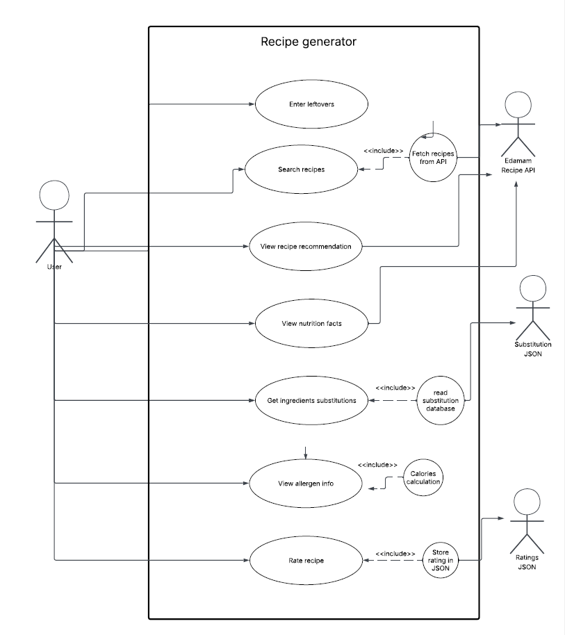

## B. SCENARIOS

The chatbot system is designed to handle multiple interaction scenarios that guide the user from input to final recipe generation.

- **User Input of Leftover Ingredients**

The AI agent first prompts the user to enter a list of leftover or nearly expired ingredients that they have on hand. Users are recommended to provide a more detailed description of what they want, such as meal type or preferences, to help the system retrieve relevant recipes.

- **Allergen information**

Before displaying the recipe list, the chatbot asks the user to provide any allergen restrictions for safety measures (e.g., nuts, dairy, gluten). This step will help the agent filter out related allergen recipes. User may also skip this step if no restrictions are needed.

- **Recipe list Retrieval**

The system retrieves recipes from Edamam Recipe API ( <https://www.edamam.com/>), which has over 2 million recipes collected from public web sources. The chatbot displays up to 20 recipe and shows 5 recipes per page. Each recipe includes main ingredients needed(top 3 ingredients, preparation time and allergen and diet information

The recipes are ranked based on how relevant they are to the user's input. If allergen restrictions are provided, recipes that include those allergens are excluded.

- Recipe Navigation and Selection

At this point, the user gets to choose either:

- View the next page of results
- Start a new search
- Select a recipe
- Exit the system

If the user reaches the last page, the "next page" option is no longer available as shown in **Figure 1**

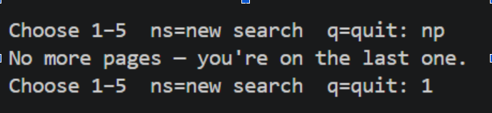

**Figure 1:** _Recipe navigation options after displaying the recipe list_

- Input Interpretation

The system output is based on detailed information provided by the user. If the user provides only basic ingredients (e.g., "milk, banana"), the system tends to suggest simple recipes such as drinks or smoothies.

**Figure 2:** _Recipe suggestions based on basic ingredient input_

However, if the user provides a more detailed description (e.g., "make a proper meal from these ingredients"), the system generates more complete dish suggestions instead, shown in **Figure 3**.
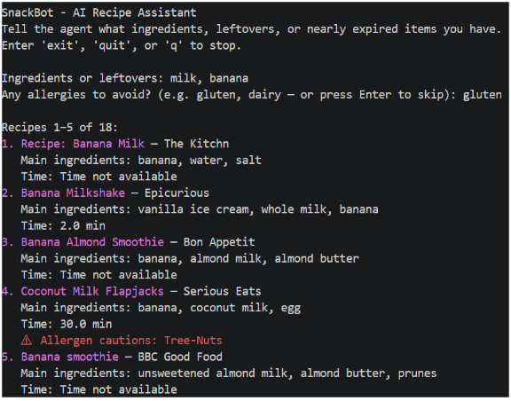

**Figure 3:** _Recipe suggestions based on detailed user description_

- Nutrition, Allergen, and Serving Size Adjustment

After a recipe is chosen, the system displays:

- Total and per-serving calories
- Serving size
- Allergen-free information and allergy description

The user is then prompted to choose a serving size (e.g., 1, 2, 4, 6, or 8 servings). The ingredient quantities are adjusted based on the serving size; either divide or multiply them. The default recipe serving size is also included for user preference.

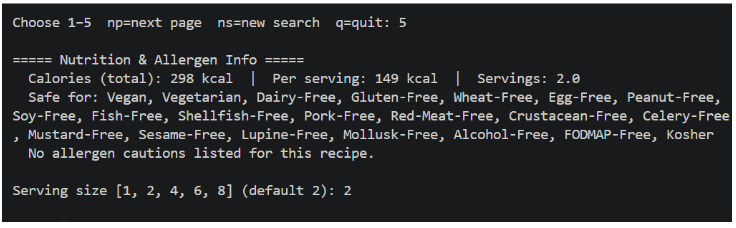
**Figure 4:** _Nutrition information and serving size selection_

- Ingredient Substitution

After generating the ingredient list, the chatbot asks whether any ingredients are missing. If missing ingredients are provided, the system retrieves substitution suggestions from a local JSON database _(substitutions.json)_. If no exact match is found, the LLM attempts to generate a reasonable alternative.

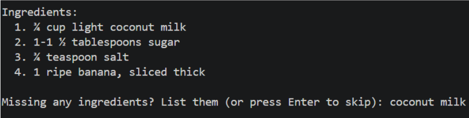
**Figure 5:** _Ingredient list with substitution suggestions_

- Recipe Generation

The AI agent generates a complete recipe, including ingredient list (with substitution notes if applicable) and step-by-step cooking instructions. The recipes are based on data from the Edamam API and constructed with AI formatting and explanations. Example from **Figure 6** below, the coconut milk has a substitution note where it could be replaced with oat milk or any nut milk.

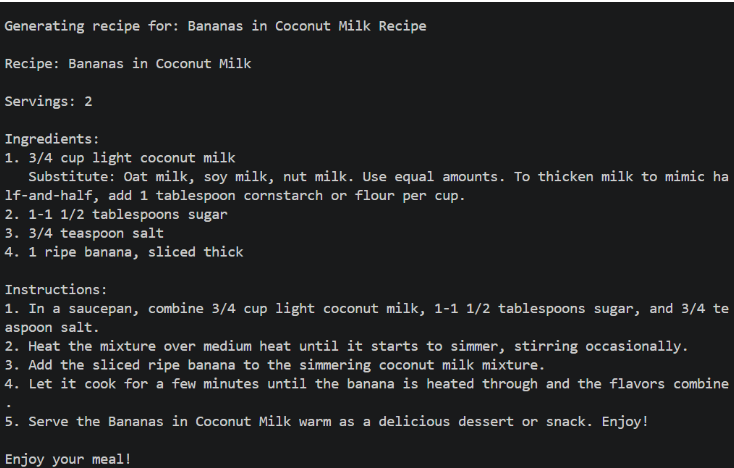
**Figure 6:** _Complete recipe with substitution notes and instructions_

- Rating Rating

At the end of the interaction, the system displays the current rating of the recipe and prompts the user to provide their own rating. These ratings are stored locally in _ratings.json_ and can be used to influence future recommendations.

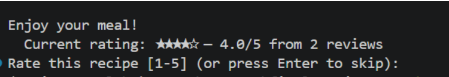
**Figure 7:** _Recipe rating display and user input_

## C. PROMPT ENGINEERING AND MODEL PARAMETER

The system uses prompt engineering to guide the LLM in generating structured and practical recipes based on the user's request. As shown in _**Figure 8**(llm_agent.py)_, a system prompt is designed to ensure the AI produces recipes in a clear and readable format for human use. The prompt also includes notes to prevent the model from invent own recipes or generates unnecessary comments. It could reduce hallucinations and make sure the output remains consistent and useful.

Other than that, because the system has serving size adjustment, the prompt includes instructions to avoid decimal values and instead use simple fractions. For ingredient substitution, the prompt ensures that the AI always provides an ingredient substitute when it is marked as missing. If the substitution is not found in the local JSON database, the model is trained to use its own knowledge to suggest a suitable replacement instead of leaving it blank.

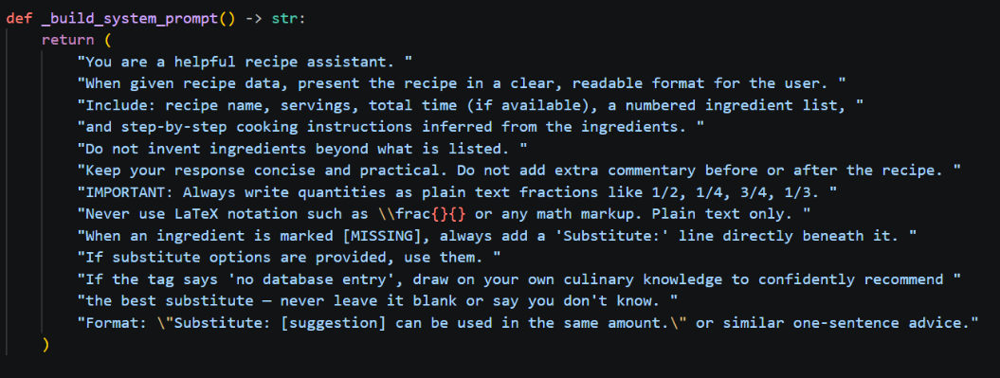
**Figure 8:** _AI system prompt design_

The function `\_build_user_prompt()`, shown in **Figure 9**, constructs the input sent to the LLM by combining recipe data, user input, and substitution information to make sure the model receives structured context for it to generate consistent outputs.

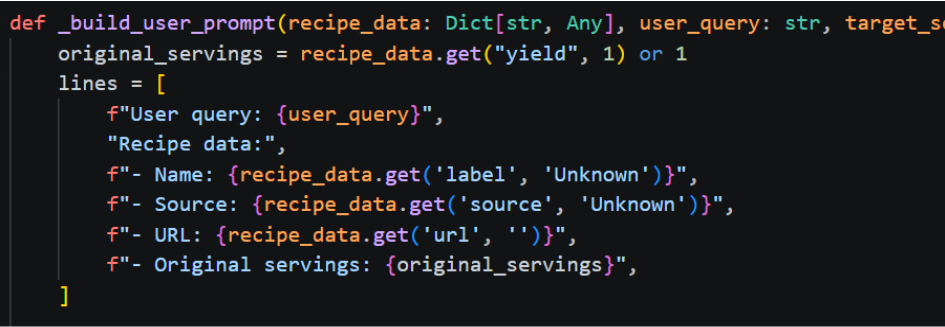
**Figure 9:** _User prompt construction function_

The system also includes an input parsing function, as shown in **Figure 10**, which allows the LLM to process natural language input from user. The user can describe their situation in a human-like way without being strict on instruction keywords. The model extracts relevant information from user input such as ingredients and meal intent.

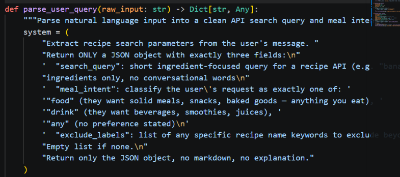
**Figure 10:** _Input parsing function_

The project uses the OpenAI API because it has fast response time and strong reasoning skills compared to local models such as Ollama, which takes way too long to respond. For model parameters, the temperature is set to 0.7 to balance between accuracy and creativity. This helps generated recipes remain practical while still following user needs. The `max_tokens` parameter is set between 700 and 1500, depending on the task, so the recipe can be generated without truncation.

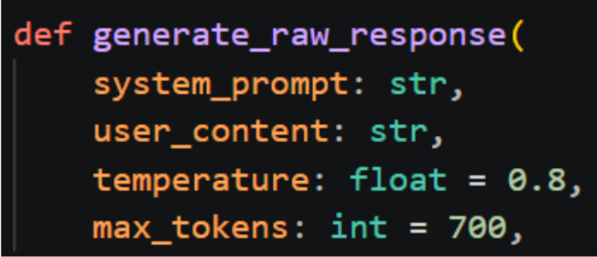
**Figure 11:** _Model parameter configuration_

## D. TOOL USAGE

To make this project work, several tools are used.

- Recipe API: Recipes are retrieved from [Edamam.com](http://edamam.com), which gives access to a large collection of recipes sourced from the public web. The system uses this API to obtain recipe data, including recipe name, source website, URL, ingredient list, allergen information, calorie count, serving size, dish type, and total preparation time. The API is queried using ingredients provided by the user to ensure the system returns relevant recipe suggestions based on user inputs.

API URL**:** <https://api.edamam.com/api/recipes/v2>

- OpenAI API: The OpenAI API is used as the language model (LLM) agent to perform reasoning, interpretation, and structured tasks within the system. This model is responsible for:
  - Parse natural language user input into structured data
  - Generate complete recipes based on API data in readable format
  - Incorporate ingredient substitution suggestion if needed
  - Establish consistent formatting for the output (ingredient lists and steps)
- Substitution JSON: The substitution JSON file acts as a local knowledge base that provides ingredient replacement suggestions. The system retrieves relevant substitutions from this database and sends them to the LLM if the user indicates missing ingredients. The database can be updated over time to improve coverage and accuracy.
- Rating JSON: The rating JSON file is used to store user feedback for each recipe. Users are recommended to rate a recipe after it is generated and saved locally. The data will be used to influence future recommendations by prioritizing higher-rated recipes first.

Additional features used:

- Allergy filter: This feature filters the recipe list based on the user's dietary restrictions to ensure safety. Any recipe containing restricted allergens is removed from the suggestions. Allergen and nutrition information is displayed again before recipe generation. For allergens not explicitly listed in the recipe data, the AI uses reasoning to identify possible allergens.
- Serving size calculation: This feature helps users to adjust the recipe serving size. Ingredient quantities are scaled according to the desired serving size while maintaining fraction measurements.
- Colorama: This tool improves readability in the terminal interface by clearly distinguishing sections.

## E. PLANNING AND REASONING 

The system follows multi-step reasoning pipeline to give the best output based on user input.

1. The system interprets the user's input in natural language to identify leftover ingredients, meal preferences, and any constraints.
2. The system queries the Edamam API to list relevant recipes based on the given ingredients, so results are from real data rather than purely generated content.
3. The retrieved API recipes are sorted and displayed to the user in pages. Recipes that are relevant to the user's input will be prioritized.
4. The user selects a recipe or navigates through the list to allow user choosing the desired recipe
5. The system applies an allergen filter based on user restriction input. Recipes that contain restricted ingredients are removed from the suggestion list
6. After a recipe is selected, the system checks whether the user has all required ingredients to ensure the recipe is practical to follow.
7. If an ingredient is missing, the system retrieves substitution suggestions from a local JSON knowledge base. If it is not available, the LLM uses its own knowledge to provide alternative options.
8. The system then generates a structured recipe using the LLM. The model incorporates retrieved recipe data, substitution information, and user preferences to produce a clear and readable output.
9. The system collects user ratings and stores them for future use to improve recommendations.

## RAG IMPLEMENTATION 

The system implements a Retrieval-Augmented Generation (RAG) approach by combining both external and local data sources.

1. External: Recipe data is retrieved from Edamam API based on ingredients provided by the user to have reliable recipe information instead of generating content from scratch. Without this, the LLM would have to hallucinate recipes from scratch. 

2. Local: `find_substitutes()` in `substitution_agent.py` looks up missing ingredients in _substitutes.json_ using exact/partial string matching. Then the result is passed into the LLM to advice on suitable substitution. **Figure 12** shows _substitutes.json_ library that includes all substitutions list.
   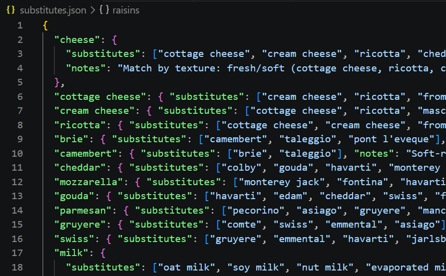
**Figure 12:** _substitutes.json library_

